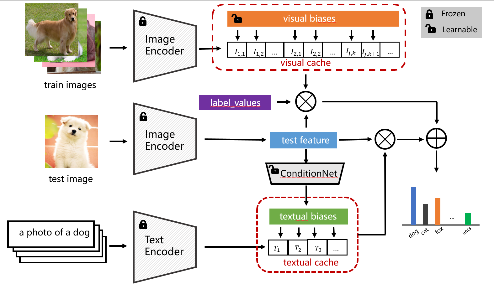

# Instance-Wise Adaptive Tuning and Caching for Vision-Language Models

Official implementation of ['Instance-Wise Adaptive Tuning and Caching for
Vision-Language Models'].

<div align="center">
  
</div>

## Requirements

### Installation

Create a conda environment and install dependencies:

```bash
conda create -n ATC python=3.9
conda activate ATC

pip install -r requirements.txt

# Install the according versions of torch and torchvision
conda install pytorch torchvision cudatoolkit
```

### Dataset

Follow [DATASET.md](https://github.com/gaopengcuhk/Tip-Adapter/blob/main/DATASET.md) to install ImageNet and other 10 datasets referring to CoOp.

## Get Started

### Configs

The running configurations can be modified in `configs/[dataset].yaml`, including shot numbers, visual encoders, and hyperparamters.

For simplicity, we provide the hyperparamters achieving the overall best performance on 1\~16 shots for a dataset, which accord with the scores reported in the paper. If respectively tuned for different shot numbers, the 1\~16-shot performance can be further improved. You can edit the `search_scale`, `search_step`, `init_beta` and `init_alpha` for fine-grained tuning.

### Running

For ImageNet dataset:

```bash
CUDA_VISIBLE_DEVICES=0 python main_imagenet.py --config configs/imagenet.yaml
```

For other 10 datasets:

```bash
CUDA_VISIBLE_DEVICES=0 python main.py --config configs/dataset.yaml
```

### Enhanced based classifiers

At the same time, we followed the method in [TaskRes](https://github.com/geekyutao/TaskRes) and used enhanced based classifiers, which will improve the classification accuracy to a certain extent.You can download [enhanced bases](https://drive.google.com/drive/folders/1_ehtvBRWbbcYZRTAcvtCyUTD_tL4GUiV) and move the folder strong_base to ATC-MAIN/.

```bash
CUDA_VISIBLE_DEVICES=0 python main_imagenet_enhanced.py --config configs/imagenet.yaml
```

## Acknowledgment

This repo benefits from [CLIP](https://github.com/openai/CLIP),[CoOp](https://github.com/KaiyangZhou/CoOp),[Tip-Adapter](https://github.com/gaopengcuhk/Tip-Adapter) and [TaskRes](https://github.com/geekyutao/TaskRes). Thanks for their wonderful works.
